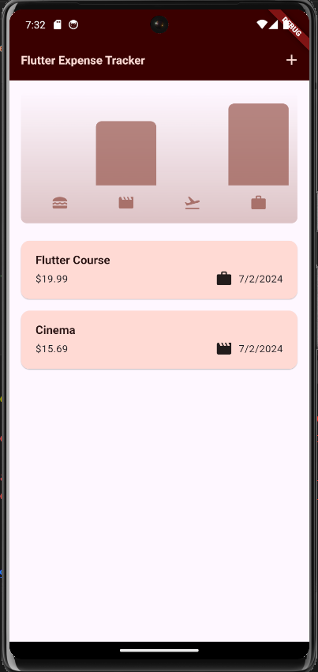
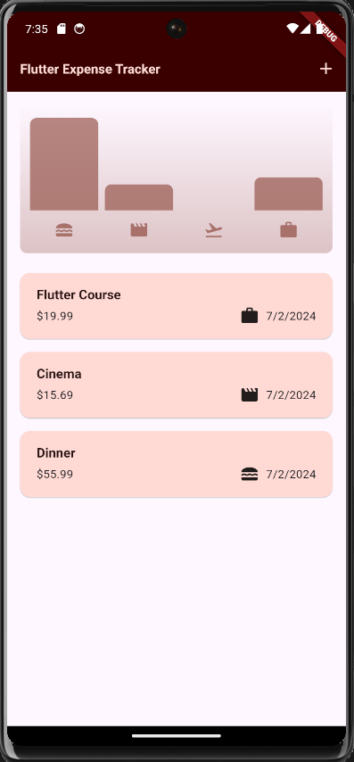

# expense_tracker

In the development of this application, a comprehensive exploration of Flutter's features and functionalities was undertaken to create a robust and user-friendly expense management tool. The incorporation of interactive elements, such as Snackbars and Modal Bottom Sheets, added a layer of dynamism to the user interface, providing real-time feedback and enhancing the overall user experience.

The management of user input was a focal point in the development process. Text fields and dropdown buttons were employed for this purpose, showcasing Flutter's versatility in handling diverse input types. The creation of a manual date picker using the built-in `showDatePicker` function demonstrated the flexibility of Flutter in custom interaction design. Additionally, the implementation of dialogs highlighted the significance of the context object, serving as a vital conduit for widget relationships within the Flutter framework.

The application also addressed various strategies for handling user input, offering insights into the usage of `TextEditingController` and manual storage for input values like `_selectedDate` and `_selectedCategory`. Understanding the necessity of properly disposing of `TextEditingController` instances using the `dispose` method was emphasized to ensure efficient memory management.

The learning journey extended to the utilization of different widgets, such as `IconButton` and `AppBar`, each contributing uniquely to the app's functionality and aesthetic appeal.

In terms of user functionality, the app enables users to effortlessly add expenses through an intuitive process, with details such as title, amount spent, category selection, and date entry. The confirmation of submissions triggers the visual display of added expenses on the screen, accompanied by an insightful chart offering a comprehensive overview of expenditure trends. The app also features a user-friendly deletion mechanism, activated by left-swiping, with an additional prompt for undoing a deleted expense. Moreover, the app dynamically adjusts its layout when auto-rotate is enabled, ensuring a seamless and adaptable user experience. These features collectively underscore the app's versatility, providing users with a powerful tool for expense management coupled with an engaging and responsive interface.

Here are the screenshots of the app:

   

   

   

Here is the demo of the app:

[Watch the video](expense_tracker_app_video.mp4)

(You have to download the video to watch it)
